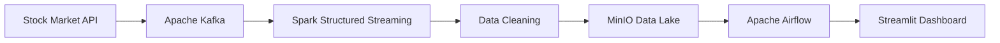

<div align="center">

# 👋 Hi, I'm Shubham Garg


<p>


</p>

<p>

<a href="https://github.com/aashubhamgarg2005-commits">

</a>

<a href="https://linkedin.com/in/shubham-garg-9465b836a">

</a>

<a href="mailto:aashubhamgarg2005@gmail.com">

</a>

</p>

### 🚀 Future Data Engineer | B.Tech CSE Student | Open Source Learner

*"Turning raw data into scalable, reliable and production-ready data pipelines."*

</div>

---

# 💫 About Me

```yaml
Name: Shubham Garg

Role:
  Future Data Engineer

Education:
  B.Tech Computer Science Engineering

Focus:
  - Data Engineering
  - Big Data
  - Cloud Computing
  - Distributed Systems

Currently Learning:
  - Apache Kafka
  - Apache Spark
  - Apache Airflow
  - PostgreSQL
  - AWS
  - Docker
  - Stream Processing

Goal:
  Become an Industry Ready Data Engineer

Current Project:
  Real-Time Stock Market Data Pipeline
```

---

# 🚀 Featured Project

# 📈 Real-Time Stock Market Data Pipeline

### Architecture



---

## Features

- ✅ Real-Time Data Streaming
- ✅ Kafka Producer & Consumer
- ✅ Spark Structured Streaming
- ✅ ETL / ELT Pipeline
- ✅ Data Validation
- ✅ MinIO Data Lake Storage
- ✅ Airflow Workflow Automation
- ✅ Interactive Streamlit Dashboard
- ✅ Dockerized Infrastructure

---

# 🛠 Tech Stack

## 👨‍💻 Languages

<p>


</p>

---

## 🗄 Database

<p>


</p>

---

## ⚡ Data Engineering

<p>


</p>

---

## 🧰 Tools

<p>


</p>

---

# 💼 Core Skills

- Data Engineering
- ETL / ELT Pipelines
- SQL Optimization
- Stream Processing
- Docker
- Data Modeling
- REST APIs
- Distributed Systems

---

# 📚 Currently Learning

| Technology | Progress |
|------------|----------|
| Python | ██████████ 100% |
| PostgreSQL | ██████████ 100% |
| Docker | █████████░ 90% |
| Apache Kafka | ████████░░ 80% |
| Apache Spark | ██████░░░░ 60% |
| Apache Airflow | ██████░░░░ 60% |
| AWS | ██░░░░░░░░ 20% |

---

# 📊 GitHub Analytics

<p align="center">


</p>

---

# 🔥 GitHub Streak

<p align="center">


</p>

---

# 📈 Contribution Graph

<p align="center">


</p>

---

# 🏆 GitHub Trophies

<p align="center">


</p>

---

# 📜 Certifications

- ✅ Python Programming
- ✅ SQL Fundamentals
- 🔄 Apache Kafka (In Progress)
- 🔄 Apache Spark (In Progress)
- 🔄 Apache Airflow (In Progress)

---

# 🚀 Roadmap

```text
✅ Python

✅ SQL

✅ PostgreSQL

✅ Docker

🟨 Apache Kafka

🟨 Apache Spark

🟨 Apache Airflow

⬜ AWS

⬜ Kubernetes

⬜ Terraform

⬜ Lakehouse

⬜ CI/CD

⬜ Production Data Engineering
```

---

# 📌 Featured Repositories

⭐ Real-Time Stock Market Data Pipeline

⭐ Weather Alert System

⭐ Kafka Learning

⭐ Spark Projects

⭐ Airflow Workflows

⭐ Docker for Data Engineering

---

# 🌱 2026 Goals

- Build 10+ Production Ready Data Engineering Projects
- Master Apache Kafka
- Master Spark Structured Streaming
- Learn AWS Data Services
- Deploy Projects on Cloud
- Contribute to Open Source
- Write Technical Blogs
- Build End-to-End Data Pipelines

---

# 💼 Open To

- Data Engineering Internship
- Backend Development Internship
- Open Source Collaboration
- Data Engineering Projects
- Cloud Projects

---

# 📊 Weekly Development Breakdown

<!--START_SECTION:waka-->

```text
Python          ████████████████████ 70%

SQL             ████████             15%

Docker          ████                  7%

Kafka           ███                   5%

Other           ██                    3%
```

<!--END_SECTION:waka-->

---

# 🌐 Connect With Me

<p align="center">

<a href="https://github.com/aashubhamgarg2005-commits">

</a>

<a href="https://linkedin.com/in/shubham-garg-9465b836a">

</a>

<a href="mailto:aashubhamgarg2005@gmail.com">

</a>

</p>

---

<div align="center">

## 💡 Quote

> **"Great data engineering isn't about moving data—it's about delivering trusted data at the right time."**

⭐ If you like my work, consider giving my repositories a **Star**.

🚀 Thanks for visiting my profile!

</div>

<!--
Future Improvements
- Add project screenshots
- Add snake contribution animation
- Add GitHub Profile Summary Cards
- Add blog section
- Add portfolio website
-->
