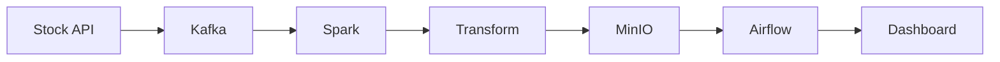

# 👋 Hi, I'm Shubham Garg

> **Professional Data Engineer Portfolio (Starter Template)**

<table>
<tr>
<td width="30%" valign="top" align="center">

## Shubham Garg
**Future Data Engineer**

Building scalable, production-ready data pipelines with Python, Kafka, Spark, Airflow and PostgreSQL.

### 📬 Connect

### 💻 Skills

- Python
- PostgreSQL
- Docker
- Apache Kafka
- Apache Spark
- Apache Airflow
- MinIO
- Streamlit

</td>

<td width="70%" valign="top">

# 🚀 About Me

B.Tech CSE student focused on Data Engineering and Real-Time Data Pipelines.

## 📈 Featured Project

### Real-Time Stock Market Data Pipeline

## 🛠 Tech Stack

## 🎯 Goals

- Build 10+ Data Engineering Projects
- Learn AWS
- Master Kafka & Spark
- Contribute to Open Source

</td>
</tr>
</table>
