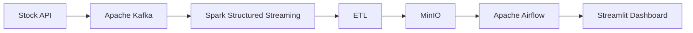

# 👋 Hi, I'm Shubham Garg

<table>
<tr>
<td width="30%" valign="top" align="center">

## Shubham Garg
### Future Data Engineer

Transforming raw data into scalable, real-time intelligence through modern Data Engineering.

### 📬 Connect

### ⚡ Skills

- Python
- PostgreSQL
- Docker
- Apache Kafka
- Apache Spark
- Apache Airflow
- MinIO
- Streamlit

### 🎯 Learning

- AWS
- Kubernetes
- Terraform
- Lakehouse

</td>

<td width="70%" valign="top">

# 💫 About Me

- 🎓 B.Tech CSE Student
- 🚀 Aspiring Data Engineer
- 💡 Passionate about Big Data & Streaming
- 📚 Learning Cloud & Distributed Systems

---

# 📈 Featured Project

## Real-Time Stock Market Data Pipeline

### Features
- Real-time streaming
- ETL pipelines
- Data validation
- Dockerized infrastructure
- Interactive dashboard

---

# 🛠 Tech Stack

---

# 🗺️ Roadmap

- ✅ Python
- ✅ SQL
- ✅ PostgreSQL
- ✅ Docker
- 🟨 Kafka
- 🟨 Spark
- 🟨 Airflow
- ⬜ AWS
- ⬜ Kubernetes
- ⬜ Terraform

---

# 🌱 Goals

- Build 10+ Data Engineering Projects
- Master Kafka & Spark
- Learn AWS Data Services
- Contribute to Open Source
- Publish Technical Blogs

</td>
</tr>
</table>

---

### ⭐ Thanks for visiting my profile!

